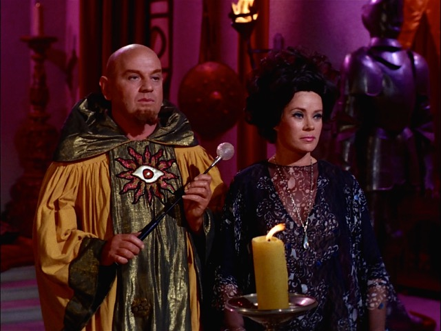

# Transmuters

Playing around with Clojure transducers.

## Usage

> You like to think of yourselves as complex creatures, but you're flawed. One gains
> admittance to your minds through many levels. You have too many to keep track of
> yourselves. There are unguarded entrances to any human mind. - *Sylvia*

*Not a library, just some experimental code.*

## License

Copyright © 2015 Steve Miner

Distributed under the Eclipse Public License, same as Clojure.

